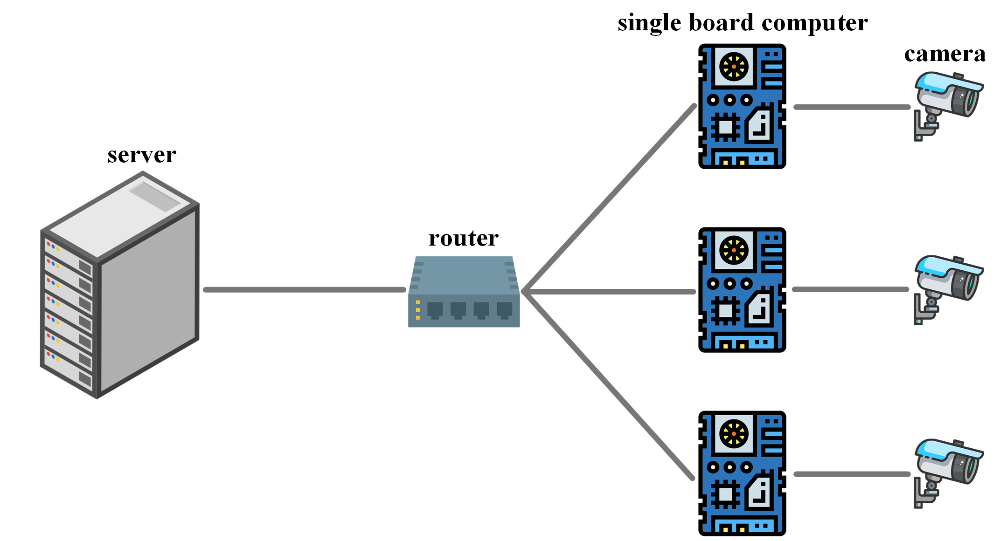
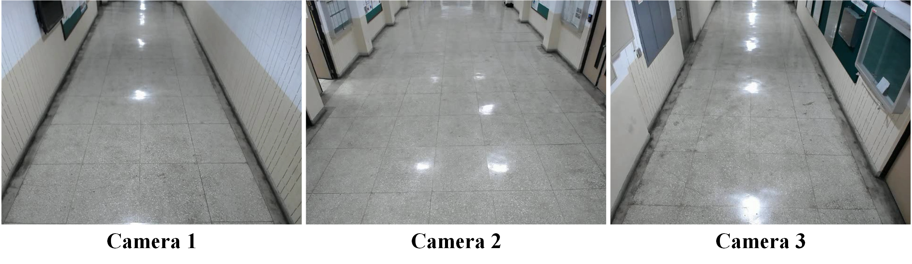

# Multiple Camera Devices Person Tracking (MCDPT)

The lightweight detection model and feature model are used in this repository to reduce the computational costs of the models. Moreover, by using the proposed single camera and multi camera peron tracking algorithms, multi camera person tracking tasks can be performed on multiple single board computers instantly. The feature information of the target person is transmitted between each camera device through the MQTT communication protocol, so that multiple camera devices with disjoint field of views (FoVs) can identify and track the same target person.

<div align="center">

</div>

## Table of Contents

- [Getting Started](#getting-started)
  - [Prerequisites](#prerequisites)
  - [Installation](#installation)
  - [Model files preparation](#model-files-preparation)
- [Usage](#usage)
  - [Command examples](#command-examples)
  - [Config settings](#config-settings)
  - [Demo output](#demo-output)
- [Tracking Accuracy Measurement](#tracking-accuracy-measurement)
  - [Dataset evaluation](#dataset-evaluation)
  - [Real environment evaluation](#real-environment-evaluation)
- [Real Environment Demo](#real-environment-demo)
- [License](#license)
- [Citation](#citation)
- [Acknowledgments](#acknowledgments)

## Getting Started
### Prerequisites

- Python 3.7.11 conda environment
- OpenVINO 2021.4 LTS
- MQTT 3.1.1 Broker server
- GStreamer

### Installation

```bash
git clone https://github.com/ChienHsuan/MCDPT.git
cd MCDPT
pip install -r requirements.txt
```

### Model files preparation

The person detection model and person re-identification model need to be prepared. In this repository, the two models are preset to use [person-detection-retail-0013](https://docs.openvino.ai/latest/omz_models_model_person_detection_retail_0013.html) and [person-reidentification-retail-0288](https://docs.openvino.ai/latest/omz_models_model_person_reidentification_retail_0288.html). You can change the default used models to your own trained models according to your needs, and you need to convert the model file to IR format model file through *OpenVINO Model Optimizer*. The model conversion example code is `convert_model_to_IR.sh`. Change the relevant argument settings according to your needs. The usage is as follows:

```bash
bash convert_model_to_IR.sh
```

## Usage
### Command examples
#### 1. Single camera tracking

The shell script executable file `run_1.sh` is used for single camera tracking, where the `-i` argument is used to determine the video or web-camera input, `--m_detector` specifies the path of the detection model IR file, `--m_reid` specifies the path of the feature model IR file, `--config` is used to specify parameter configuration file. To perform single camera tracking, execute the following command:

```bash
bash run_1.sh
```

Other input arguments can be used as appropriate. To show all available arguments run the command:

```bash
python multi_camera_multi_target_tracking.py -h
```

#### 2. Multiple camera devices tracking

If it is used for multi camera tracking, it can be used to create multiple executable files belonging to different cameras according to `run_1.sh`, where the `--broker_url` argument is used to set the MQTT Broker IP, `--device1` and `--device2` arguments set hardware devices for detection model and feature model respectively to use *OpenVINO Inference Engine* (`'MYRIAD'` use NCS2 and `'CPU'` use CPU). In addition, `--cam_id` argument is used as the camera ID parameter to distinguish persons in different cameras, so you must set a different number for each camera.

To run the tests on the same device:

```bash
bash run_1.sh & bash run_2.sh & bash run_3.sh
```

Run on individual different camera devices:

```bash
# for camera device 1
bash run_1.sh

# for camera device 2
bash run_2.sh

# for camera device 3
bash run_3.sh
```

#### 3. Other person tracking algorithms

`--method 'mtmct'` is the algorithm proposed by [this thesis](#citation). In addition, the argument can be set to `'deepsortplus'`, and use the config file in `configs\deepsort\` to apply the Deep Sort tracking algorithm for multi camera person tracking.

### Config settings

The `--config` argument specifies the parameter configuration file to use. The config files in the `configs/` folder are used for `--method 'mtmct'`. The config files in the `configs/deepsort/` folder are used for `--method 'deepsortplus'`. The parameter configuration files `person.py` and `person_random.py` are used for the real environment person tracking in this thesis, for situations with high and low repetition of passing persons, respectively. `person_evaluation.py` is used for dataset evaluation experiments.

### Demo output

The demo displays bounding boxes of tracked objects and unique IDs of those objects. To save output video with the result please use the option `--output_video` to specify the output filename (.mp4).

Visualization can be controlled using the following keys:

 * `space` : pause or next frame
 * `enter` : resume video
 * `esc` : exit

To use GStreamer to stream the output video of each camera device to the backend server, add the `--video_streaming` argument. `video_streaming.py` is used for server to display or record output videos from various camera devices.

## Tracking Accuracy Measurement

The [OSNet-AIN](https://arxiv.org/abs/1910.06827) is adopted as feature model in this experiment, and set $\beta = 0.5$. Moreover, use the UDA person re-ID method [Contrastive Mutual Learning Distillation (CMLD)](https://github.com/ChienHsuan/CMLD) for training, and the person image size is set to 192 $\times$ 96.

### Dataset evaluation

This repository uses the [Multi Camera Track Auto (MTA) dataset](https://openaccess.thecvf.com/content_CVPRW_2020/papers/w70/Kohl_The_MTA_Dataset_for_Multi-Target_Multi-Camera_Pedestrian_Tracking_by_Weighted_CVPRW_2020_paper.pdf) as test dataset for single camera and multi camera person tracking, which contains 2,840 person identities and 6 camera scenes (Camera 0 ~ Camera 5). Among them, MTA-ReID is used as an unlabeled target domain dataset for person re-identification to train feature models. The test set in the MTA-Ext-Short dataset is used to evaluate person tracking accuracy.

In the executable file `mta_eval_1.sh`, `-i` sets the path of the MTA-Ext-Short dataset, `person_evaluation.py` is used as the config file, and `--logs_dir` is the output directory for the txt file of the person tracking results. To test on the MTA-Ext-Short test set, execute the following command:

```bash
bash mta_eval_1.sh
```

Other input arguments can be used as appropriate. To show all available arguments run the command:

```bash
python mta_evaluation.py -h
```

#### Single camera and multi camera person tracking accuracy evaluation

Calculate the person tracking accuracy of each frame according to the txt files of tracking results, and use [WDA tracker](https://github.com/ChienHsuan/wda_tracker) to calculate the accuracy indicators, including ID-related accuracy indicators such as IDF1, IDP, IDR, and IDS. In addition, the processing speed FPS is also calculated.

##### 1. Single camera tracking (SCT)

To calculate the single camera person tracking accuracy in camera 0 ~ 5, execute the command:

```bash
bash single_cam_eval.sh
```

The following are the experiment results in this thesis:

| Camera | IDF1 | IDP | IDR | IDs | FPS |
| :---: | :---: | :---: | :---: | :---:| :---:|
| 0 | 0.4524 | 0.5341 | 0.3973 | 367 | 76.7 |
| 1 | 0.3808 | 0.5459 | 0.3018 | 472 | 50.8 |
| 2 | 0.6416 | 0.7415 | 0.5708 | 959 | 17.5 |
| 3 | 0.5835 | 0.659 | 0.5302 | 1796 | 10.5 |
| 4 | 0.7057 | 0.76 | 0.6693 | 199 | 36.5 |
| 5 | 0.4381 | 0.5206 | 0.3829 | 1353 | 25.0 |
| avg | 0.5337 | 0.6268 | 0.4754 | 858 | 36.2 |

##### 2. Multi camera tracking (MCT)

To calculate the multi camera person tracking accuracy between cameras 0, 1 and 4, execute the command:

```bash
bash multi_cam_eval.sh
```

The following are the experiment results in this thesis:

| Method | IDF1 | IDP | IDR | IDs |
| :---: | :---: | :---: | :---: | :---:|
| This thesis | 0.4857 | 0.6004 | 0.4078 | 1163 |

### Real environment evaluation

<div align="center">

</div>

Person tracking accuracy in the real environment is calculated using the tracking accuracy metrics IDF1 and IDS. However, the real environment data is not labeled in this thesis, so the tracking results are scored by visualization way. The processing speed FPS on each camera device is also calculated.

The following are the experiment results in this thesis:

| method | IDF1 | IDs |
| :---: | :---: | :---: |
| This thesis | 0.8423 | 59 |

| method | FPS(Cam 1) | FPS(Cam 1) | FPS(Cam 1) | FPS(Avg) |
| :---: | :---: | :---: | :---: | :---: |
| This thesis | 43.8 | 24.7 | 32.2 | 33.6 |

## Real Environment Demo

The form of person ID is (camera ID - person ID in single camera), and each person has own unique label. The following is the person tracking result on each camera device in this thesis.

<div align="center">

</div>

For more details, please refer to [*Person re-identification and tracking for multiple embedded edge cameras*](https://hdl.handle.net/11296/8vzvt2).

## License

The MIT License (MIT)  
Copyright (c) 2022 Chien-Hsuan Yen

## Citation

```
@mastersthesis{yen2022person,
    author = {Yen, Chien-Hsuan},
    title = {Person re-identification and tracking for multiple embedded edge cameras},
    type = {M.S. thesis},
    institution = {Dept. of Elect. Eng., Natl. Taipei Univ. of Tech.},
    location = {Taipei, Taiwan},
    year = {2022},
    url = {https://hdl.handle.net/11296/8vzvt2}
}
```

## Acknowledgments

[OpenVINO<sup>TM</sup> Toolkit](https://github.com/openvinotoolkit)  
[Sort](https://github.com/abewley/sort)  
[Deep Sort](https://github.com/nwojke/deep_sort)  
[The MTA Dataset](https://github.com/schuar-iosb/mta-dataset)  
[WDA tracker](https://github.com/koehlp/wda_tracker)  
